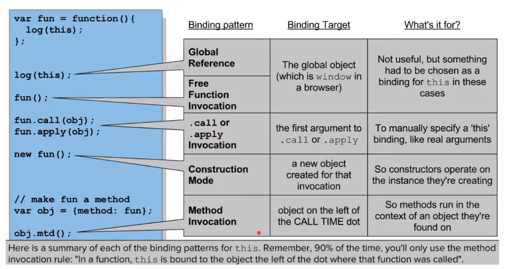

**'this' keyword**

- 모든 함수 scope 내에서 자동으로 설정되는 특수한 식별자
- execution context의 구성 요소 중 하나로, 함수가 실행되는 동안 이용할 수 있다.

---

# this의 종류



## 1. global this

**: window**

```js
this; //=> Window {...}
```

## 2. function invocation(호출)

**: window**

```js
function foo() {
  console.log(this);
}
foo(); //=> Window {...}
```

## 3. method invocation

**: 부모 object**

```js
var obj = {
  fn: function () {
    console.log(this);
  },
};
obj.fn(); //=> {fn: f}
```

- ```js
  var obj2 = {
    hello: {
      fn: function () {
        console.log(this);
      },
    },
  };
  obj.hello.fn(); //=> {fn: f}
  //method invocation의 this: 바로 자기 위의 부모만 가져옴
  ```

_3, 4는 사실상 같은 의미_

## 4. construction mode(new 연산자로 생성된 function 영역의 this)

**: 새로 생성된 객체**

```js
function Car(brand, name, color) {
  this.brand = brand;
  this.name = name;
  this.color = color;
}
Car.prototype.drive = function () {
  console.log(this.name + "가 운전을 시작합니다");
};
let myCar = new Car("chrysler", "300c", "black");
myCar.color; //'black'
myCar.drive; //'300c가 운전을 시작합니다'
```
